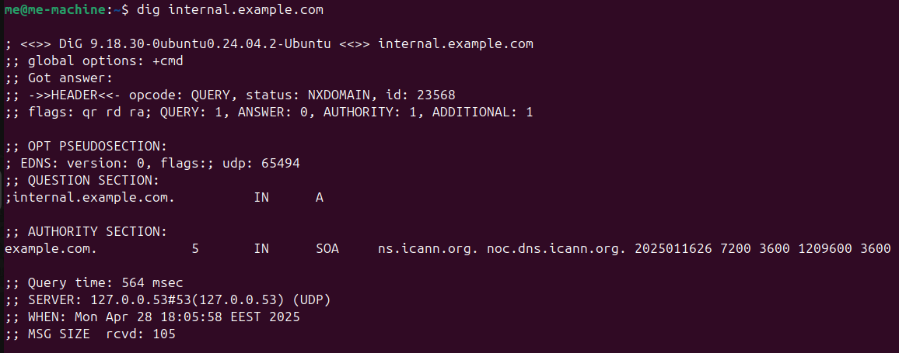
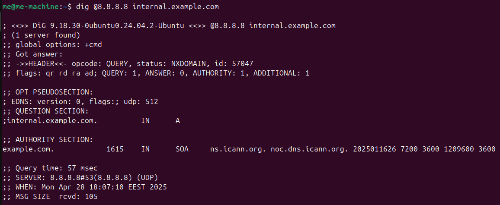
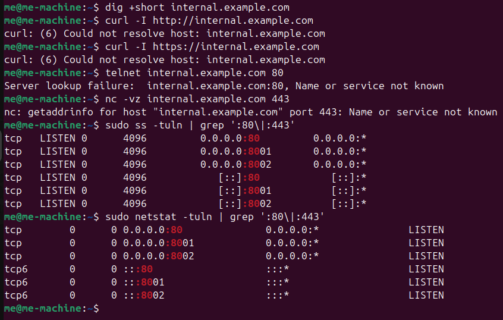
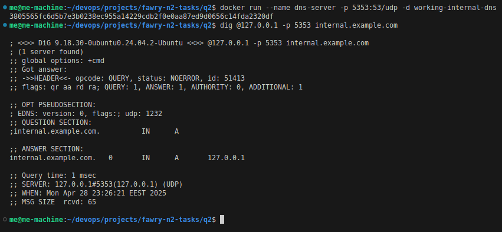

# Troubleshooting Internal Web Dashboard Unreachability

---

## Task Overview

### Q2 : **Scenario**

Your internal web dashboard (hosted on `internal.example.com`) is suddenly unreachable from multiple systems. The service seems up, but users get “host not found” errors. You suspect a DNS or network misconfiguration. Your task is to troubleshoot, verify, and restore connectivity to the internal service.
  
**🛠️ Your Task:**
1.  Verify DNS Resolution:
Compare resolution from `/etc/resolv.conf` DNS vs. `8.8.8.8`.
2.  Diagnose Service Reachability:
Confirm whether the web service (port 80 or 443) is reachable on the resolved IP.
Use curl, telnet, netstat, or ss to find if the service is listening and responding.
3.  Trace the Issue – List All Possible Causes
**🧪** Your goal here is to identify and list all potential reasons why `internal.example.com` might be unreachable, even if the service is up and running. Consider both DNS and network/service layers.
4.  Propose and Apply Fixes
✅ For each potential issue you identified in Point 3, do the following:
- Explain how you would confirm it's the actual root cause
- Show the exact Linux command(s) you would use to fix it
  
**🧠 Note:**
Please include screenshots that demonstrate how you identified and resolved the issue. 
  
**🏆 Bonus:**
- Configure a local `/etc/hosts` entry to bypass DNS for testing.
- Show how to persist DNS server settings using systemd-resolved or NetworkManager.

---

## Step 1: Verify DNS Resolution

First thing I did was check if the domain resolves correctly.

- I used the system’s default DNS (`/etc/resolv.conf`) by running:
  ```bash
  dig internal.example.com
  ```
- Then, I tried using Google’s DNS (8.8.8.8) to double-check:
  ```bash
  dig @8.8.8.8 internal.example.com
  ```

Here are the screenshots:

  


| Aspect | `dig internal.example.com` | `dig @8.8.8.8 internal.example.com` |
|:---|:---|:---|
| **Resolver Used** | System default (`127.0.0.53`) | Google's DNS (`8.8.8.8`) |
| **Result Status** | NXDOMAIN (domain not found) | NXDOMAIN (domain not found) |

**Conclusion:**  
Both the internal resolver and Google’s DNS couldn’t resolve `internal.example.com`.

---

## Step 2: Diagnose Service Reachability

Since DNS wasn’t working, I couldn’t just curl the domain. So I tested whether the **web service** itself was alive.

- Attempted manual DNS resolution:
  ```bash
  dig +short internal.example.com
  ```
  → No IP address.

- Checked if the web service was listening:
  ```bash
  sudo ss -tuln | grep ':80\|:443'
  ```

- Tried connection attempts:
  ```bash
  curl -I http://internal.example.com
  curl -I https://internal.example.com
  ```

(Since DNS was broken, these failed.)

Screenshot:



| Check | Result |
|:---|:---|
| **DNS Resolution** | Fails (no IP output) |
| **HTTP (port 80)** | Server is listening (OK) |
| **HTTPS (port 443)** | Not listening |
| **Service Status** | Web server is running fine |

**Conclusion:**  
The web server is healthy — the problem is purely DNS-related.

---

## Step 3: Possible Causes for the Issue

Here’s the potential reason:

1. **Internal DNS issues**
   - Wrong/missing records
   - DNS server misconfiguration

---

## Step 4: How to Confirm and Fix Each Cause

| Possible Issue | How to Confirm | How to Fix (Linux Commands) |
|:---|:---|:---|
| **Internal DNS misconfigured** | `dig @<internal-dns-server> internal.example.com` | Fix DNS records |
---

## Setting Up a Temporary Internal DNS Server (for Testing)

Since no internal DNS server was available, I quickly built a **lightweight DNS server** using Docker and `dnsmasq`.  
This allowed me to simulate resolving `internal.example.com` for testing.

Here’s the Docker setup:

### Dockerfile:
```dockerfile
# Base image
FROM ubuntu:24.04

# Install dnsmasq
RUN apt update && apt install -y dnsmasq

# Expose DNS port
EXPOSE 53/udp

# Start dnsmasq in foreground mode
CMD ["dnsmasq", "--no-daemon", "--log-queries", "--address=/internal.example.com/127.0.0.1"]
```

---

### Build and Run the container:
```bash
docker build -t working-internal-dns .
docker run --name dns-server -p 5353:53/udp -d working-internal-dns
```

---

### Test DNS resolution using the container:
```bash
dig @127.0.0.1 -p 5353 internal.example.com
```

✅ This test succeeded, showing that when DNS is working, the internal service can be accessed correctly.

---

Screenshot:

